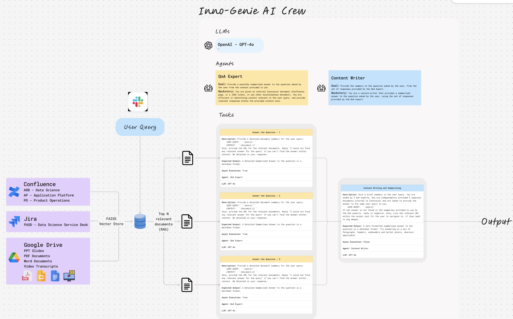

# hack-weekends-2024
Data-Zenith is an intelligent enterprise search and analytics platform that leverages advanced AI technologies to provide precise answers to user queries from organizational knowledge bases.

### Features
- Integration with enterprise tools:
    - Confluence data parsing and extraction
    - JIRA ticket analysis
    - Document summarization
- Vector stores for efficient document retrieval
- AI-powered question answering using CrewAI framework
- Multi-agent collaboration with specialized roles:
    - QnA Expert agent for answering questions
    - Content Writer agent for summarizing information

### Usage
The system utilizes a crew of AI agents working together to answer questions:

1. Three QnA Expert agents analyze different document sources independently
2. Content Writer agent compiles their findings into a comprehensive answer
3. Answers are formatted with markdown and include source references



### Data Processing Pipeline
1. Parse data from Confluence and JIRA
2. Create vector stores for efficient retrieval
3. Deploy QnA agents to extract insights from documents
4. Synthesize information into comprehensive answers

### Setup
```# Set required environment variables
export OPENAI_API_KEY="your-api-key"
export OPENAI_ENDPOINT="your-azure-endpoint"
export ATLASSIAN_USERNAME="your-username"
export ATLASSIAN_PASSWORD="your-password"
```